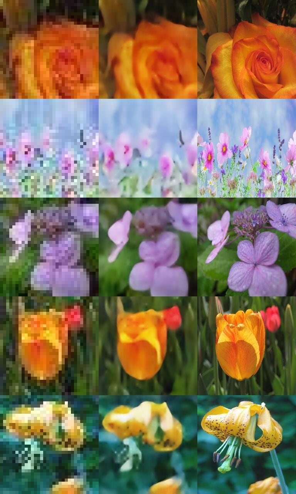

# Results
Images predicted with SRDenseNet:

# Tips on GAN and optimization for superres
## Architecture
### SRGAN
- Can train generator only, then GAN, then generator only (while loading models in between)
- After GAN training, can save its model then use generator model only to perform SR and use metrics

### To explore
- Add training progress on images (gif)
- Add data augmentation examples
- Use VGG16 pretrained network
- Why exploding gradients with perceptual_distance as loss function

## Notes
- MSE gives worse performance than perceptual_distance
- Try EDSR without final convolution **Seems better with final convolution layer**
- Scale all pixel values to the range [-1, 1] **Seems worse than [0, 1], maybe because of the use of tanh instead of relu**
- Try LapSRN (good for x8) **Seems to have poor performance**

## Optimization of network
- Tips and tricks to make GANs work https://github.com/soumith/ganhacks
- After sub-pixel convolution, next convolution can't have relu as activation

## Ideas
- Deconvolution and Checkerboard Artifacts https://distill.pub/2016/deconv-checkerboard/
